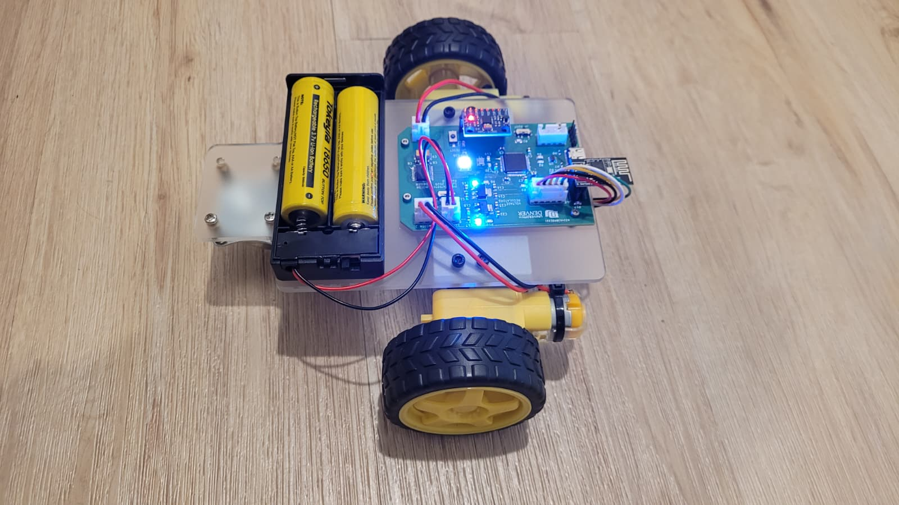
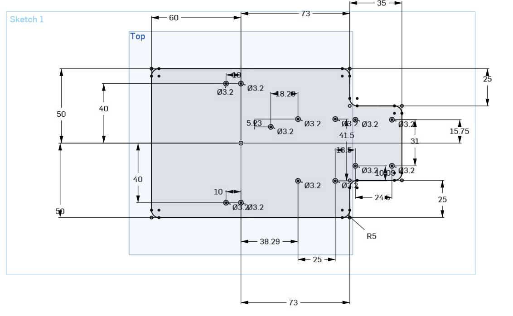
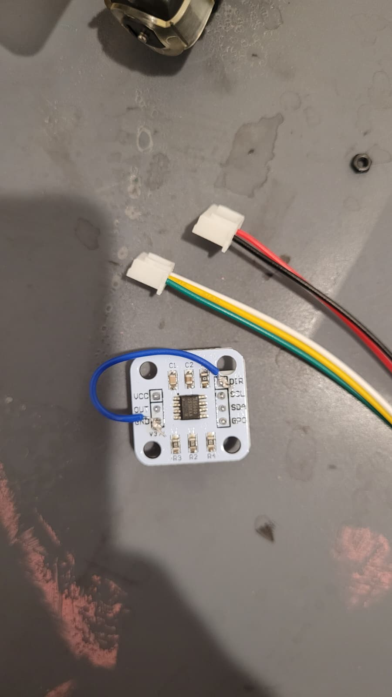
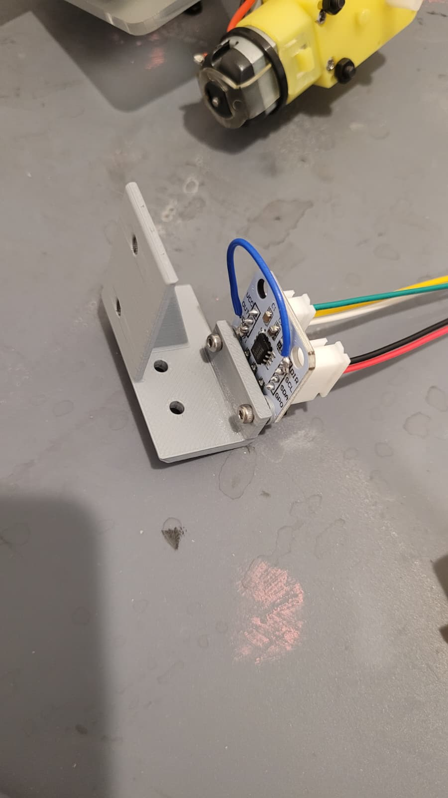
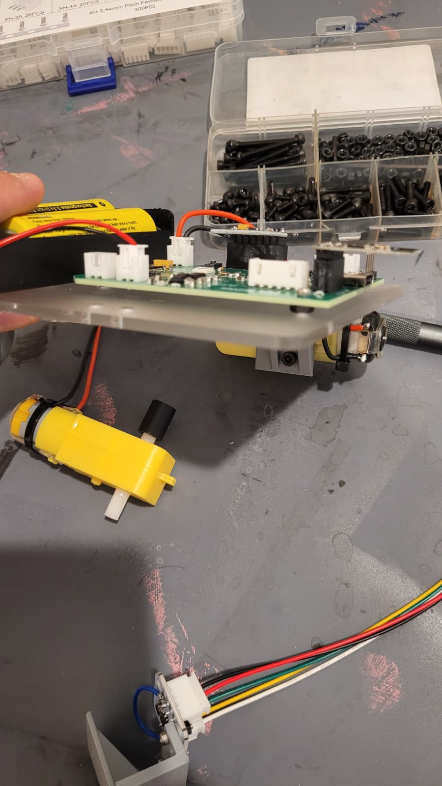

# 2-Wheel Balance Robot — Firmware & Control


<!-- TODO: hero photo of the finished 2-wheel robot (rename to match your file) -->

A self-balancing two-wheel robot built on the EngrEDU Embedded Systems platform
(STM32F401). This report covers the **firmware and control** side: taking the
working 3-wheel rover and turning it into an inverted-pendulum robot that balances
on its two driven wheels and can be driven over WiFi.

> Built as the "balance" challenge on top of the 3-wheel base described in the
> [course blog](http://engredu.com/2026/05/01/2-wheel-balance-robot/).

---

## Table of Contents
- [Introduction](#introduction)
- [System Overview](#system-overview)
- [Control Architecture](#control-architecture)
- [Stage 0 — Assembly](#stage-0-assembly)
- [Stage 1 — Straight-Line Driving](#stage-1-straight-line-driving)
- [Stage 2 — Estimating the Tilt Angle](#stage-2-tilt-angle)
- [Stage 3 — The Inner Balance Loop](#stage-3-inner-loop)
- [Stage 4 — Taming Vibration & Resonance](#stage-4-vibration)
- [Stage 5 — The Encoder Outer Loop](#stage-5-outer-loop)
- [Stage 6 — Driving While Balancing](#stage-6-driving)
- [Future Improvements](#future-improvements)
- [UART Protocol](#uart-protocol)
- [Repository Structure](#repository-structure)
- [Credits](#credits)

---

<a id="introduction"></a>
## ✔️ Introduction

A robot standing on two wheels is an **inverted pendulum**: inherently unstable,
so it needs active control to stay upright. The idea behind everything here is
simple — when the body tips, drive the wheels *toward* the fall to get them back
under the center of mass, exactly like balancing a broom on your hand.

The platform already worked as a stable 3-wheel rover. The challenge was to lift
the third (free) wheel off the ground and keep the robot upright on the two driven
wheels alone, while still being able to drive it around.



---

<a id="system-overview"></a>
## ✔️ System Overview

| Component | Part | Interface |
|-----------|------|-----------|
| Microcontroller | STM32F401RBT6 (64-pin LQFP) | — |
| IMU | MPU6050 (accel + gyro) | I2C1 |
| Wheel encoder | MT6701 magnetic encoder (right wheel) | I2C3 |
| Motor driver | TB6612 (two DC motors) | PWM on TIM2 + direction GPIO |
| Status LED | WS2812 RGB | TIM5 PWM + DMA |
| Comms / GUI | ESP8266 WiFi → browser GUI | UART |

The ESP8266 hosts a WiFi access point and a web GUI; the user steers the robot and
reads telemetry from a browser. It forwards single-character commands to the STM32
over UART.

---

<a id="control-architecture"></a>
## ✔️ Control Architecture

The robot uses a **cascade controller** — two nested loops:

- **Inner loop (≈100 Hz) — stay upright.** A PD controller on the body's tilt
  angle (pitch). This is the fast loop that does the actual balancing, using only
  the IMU.
- **Outer loop (≈10 Hz) — don't run away.** A slower controller on wheel velocity
  (from the encoder) that sets the *pitch setpoint* of the inner loop. It stops
  the robot from drifting, finds the true balance angle automatically, and is also
  how drive commands are applied.

Key principle: **the robot moves by leaning, not by spinning the wheels directly.**
Any direct wheel command is treated by the inner loop as a disturbance and cancelled.
To move, you ask the robot to *want* a velocity, and the outer loop leans it to get
there.

```
inner loop @100Hz:  u = Kp*(setpoint - pitch) - Kd*gyro_rate     (both wheels, symmetric)
outer loop @10Hz:   setpoint = BASE - (Kv_p*vel_err + Kv_i*∫vel_err)
                    vel_err  = vel_target - wheel_velocity
```

---

<a id="stage-0-assembly"></a>
## 🔧 Stage 0 — Assembly

- **Base:** A piece of acrylic was laser-cut at the Innovation Lab on a CO2 cutter.
  The design was made in Onshape and exported as a `.DXF` from the sketch. Because of
  small measurement errors when printing the 1:1 template on paper, three of the PCB
  mounting holes were drilled by hand at the correct positions.
- **Encoder:** JST-HX connectors were soldered to the encoder, and its `DIR` pin was
  tied to ground to fix the velocity-reading direction. It is mounted close to the
  magnet on the DC motor, on 3D-printed spacers that keep its exposed components from
  short-circuiting against the motor.
- **PCB:** Spacers under the PCB keep it from pressing against the pins underneath.









---

<a id="stage-1-straight-line-driving"></a>
## 🔧 Stage 1 — Straight-Line Driving

Before balancing, the rover had to drive straight. Two fixes:

- **Direction:** the two motors are mirror-mounted, so they need opposite electrical
  polarity to roll the same way. Handled with a per-motor sign/offset.
- **Speed mismatch:** one wheel ran faster than the other. Fixed with a per-wheel
  trim factor so equal commands produce equal speed.

📹 [First test](IMG/first_test.mp4) · 📹 [Driving straight](IMG/straight_test.mp4)

---

<a id="stage-2-tilt-angle"></a>
## 🔧 Stage 2 — Estimating the Tilt Angle

Balancing is only as good as the angle estimate. Neither sensor works alone:
the **gyroscope** gives a clean, fast rate but drifts when integrated; the
**accelerometer** gives an absolute angle from gravity but is noisy and polluted by
the robot's own motion. A **complementary filter** fuses them, trusting the gyro
short-term and correcting drift with the accelerometer long-term.

The relevant axis is **pitch** (fore/aft tilt). On this build, leaning forward reads
as a *negative* pitch, and the robot sits near 0° when upright. The side-to-side
(roll) axis is not controlled — two coaxial wheels can't correct it.

---

<a id="stage-3-inner-loop"></a>
## 🔧 Stage 3 — The Inner Balance Loop

A PD controller on pitch, running in the 100 Hz IMU loop:

- **P term** reacts to *how far* the robot is tilted.
- **D term** (the gyro rate) reacts to *how fast* it is falling, damping oscillation.
- The output is applied **symmetrically** to both wheels.

A **safety cut-off** brakes the motors if the tilt exceeds a threshold (it has
fallen). The trip is **latched with hysteresis** so it doesn't flicker between
"braking" and "full power" while the robot is on the ground.

Tuning order that worked: raise `Kp` until the wheels firmly resist a push, then add
`Kd` to kill the resulting oscillation, then trim the setpoint until it stops creeping.

📹 [Balancing — first test](IMG/balancing_test_1.mp4) · 📹 [Balancing — safety margin test](IMG/balancing_margin_test.mp4)

---

<a id="stage-4-vibration"></a>
## 🔧 Stage 4 — Taming Vibration & Resonance

The hardest problem was a **feedback loop through the structure**: the motors vibrate
the chassis → the IMU is bolted to that chassis → it reads the vibration as real tilt
→ the controller fights a ghost → more vibration. This is a resonance, not a gain you
can tune away. What fixed it:

- **Lower the IMU's internal low-pass (DLPF) bandwidth** so vibration above the loop's
  Nyquist frequency can't alias into the control band.
- **Low-pass filter the D term** so the gyro's high-frequency content doesn't reach
  the motors.
- **Bring the center of mass closer to the axle.** With the battery mounted on top the
  robot was very unstable, so the assembly was changed to move the battery underneath.
  A center of mass closer to the axis of rotation made balancing much more manageable.
- **Stiffen the 3D-printed mounts** to push their resonant frequency out of the
  control band.

📹 [Balancing — center of mass lowered](IMG/balancing_battery_bottom.mp4)

---

<a id="stage-5-outer-loop"></a>
## 🔧 Stage 5 — The Encoder Outer Loop

A PD-only balancer stays upright but always drifts, because nothing controls position.
The outer loop closes that gap using the MT6701 wheel-velocity reading:

- If the robot rolls forward, the loop leans the setpoint slightly *back* until the
  wheels stop.
- Its **integral term finds the true balance angle automatically**, so the center of
  mass no longer has to be guessed by hand.

The outer loop runs at 10 Hz (≈10× slower than the inner loop) so the two don't fight.

📹 [Balancing — standing test](IMG/balancing_standing_test.mp4)

---

<a id="stage-6-driving"></a>
## 🔧 Stage 6 — Driving While Balancing

Because the robot moves by leaning, the WiFi commands don't drive the motors directly —
they set a **velocity target** for the outer loop, which leans the robot to reach it:

- `w` / `s` → forward / backward velocity target
- `x` → zero velocity target (hold position — **not** a wheel brake, which would drop it)
- Because of limited time, only forward and backward motion were tested.

📹 [Driving while balancing](IMG/balancing_direction_test.mp4)

---

<a id="future-improvements"></a>
## ✔️ Future Improvements

- **Tune the gains.** The PD, safety, and wheel-speed parameters still need systematic
  tuning to improve performance.
- **Steering (left/right).** A differential term would be added on top of the symmetric
  balance command to implement turning.
- **Robustness testing.** Add test cases to find the conditions where the control loop
  fails, and harden against them.

---

<a id="uart-protocol"></a>
## ✔️ UART Protocol

Commands (single characters from the ESP8266 GUI):

| Cmd | Action |
|-----|--------|
| `w` | forward |
| `s` | backward |
| `a` | turn left *(defined; steering not yet implemented in balance mode)* |
| `d` | turn right *(defined; steering not yet implemented in balance mode)* |
| `x` | stop / hold position |

Telemetry packet (sent periodically):

```
$speed,roll,pitch,counter\n
```

---

<a id="repository-structure"></a>
## ✔️ Repository Structure

```
.
├── Projects/2026_STM32F401_2Wheel_Balance/   # STM32CubeIDE project + libraries
├── IMG/                                       # photos and demo clips
└── README.md
```

---

<a id="credits"></a>
## ✔️ Credits

- Platform, PCB, and 3-wheel base: EngrEDU Embedded Systems course by Gonçalo Martins —
  [project blog](http://engredu.com/2026/05/01/2-wheel-balance-robot/).
- Balancing firmware and control: this project.
